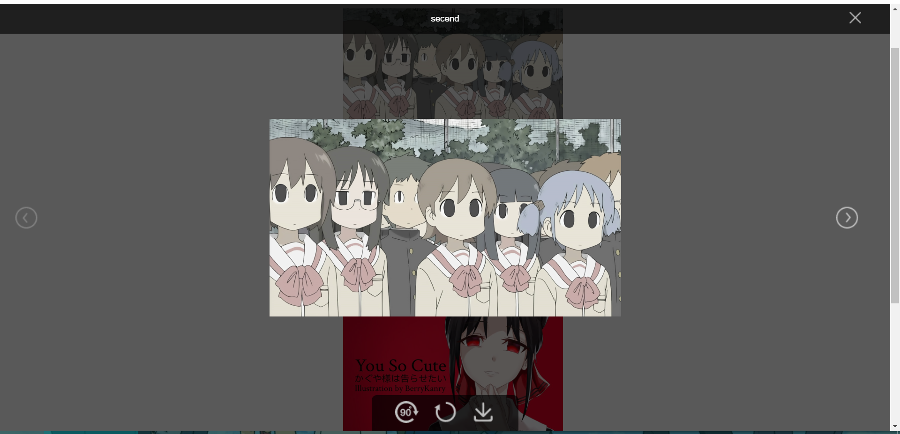

# vue-previewer
## 网页端图片预览组件，使用了vue和ts，scss




## 使用方式

1. 安装
```shell
yarn add vue-img-previewer
```
```shell
npm i vue-img-previewer --save
```
2. 然后在要使用的组件里按照下面的类似格式书写
```javascript
<template>
  <div class="hello">
    <li v-for="(item,index) in imgDataList"
        :key="index">
      </li>
    <ImgPreview :viewerVisible.sync="viewerVisible"
                :imgDataList.sync="imgDataList"
                :imgIndex.sync="imgIndex"
                ref="ImgPreview"></ImgPreview>

  </div>
</template>

<script lang="ts">
import { Component, Prop, Vue } from 'vue-property-decorator';
import {ImgPreview} from 'vue-img-previewer';

@Component({
  components: {
    ImgPreview,
  },
})
export default class HelloWorld extends Vue {
  public viewerVisible: boolean = false; // 子组件中viewer的可见性
  public imgIndex: number = 100; // 图片的索引
  public imgDataList: any[] = [
    { title: 'secend', url: require('./testImg/261652.jpg'), id: 2 },
    { title: 'third', url: require('./testImg/164F25161-2.jpg'), id: 3 },
    { title: 'four', url: './testImg/596296.jpg', id: 4 },
    { title: 'five', url: require('./testImg/timg.jpg'), id: 5 },
    { title: 'six', url: require('./testImg/245484.jpg'), id: 6 },
  ]; // 得到的img的数据，请务必按照这个格式写
  public showViewer(index: number) {
    this.imgIndex = index;
    setTimeout(() => {
      this.viewerVisible = true;
      (this.$refs.ImgPreview as any).init(this.imgIndex);
    }, 0)
  }
}
</script>
```
`上面为了简单测试，直接用了require，这里可以是从后端拿到的base64数据`
```
图片数据的格式需为
{ title: 'xxx', url: 'xxxxxx.xxx', id: x }
```

3. 运行
```shell
yarn serve
```
```shell
npm run serve
```
## 参数

|名称|功能|默认值|可选值|
|:-|:-:|:-:|-:|
|viewerVisible|vue-previewer的可见性，必填值|null|false|
|imgIndex|图片的索引，必填值|null|0-~|
|imgDataList|图片的数据|null|数组类型按照{ title: 'xxx', url: 'xxxxxx.xxx', id: x }|

## 组件简单，注释详细，易于第二次开发

### v0.2.0
```
修复图片重定位bug
```

### v0.1.0
```
初步完善功能，发布到npm
```
